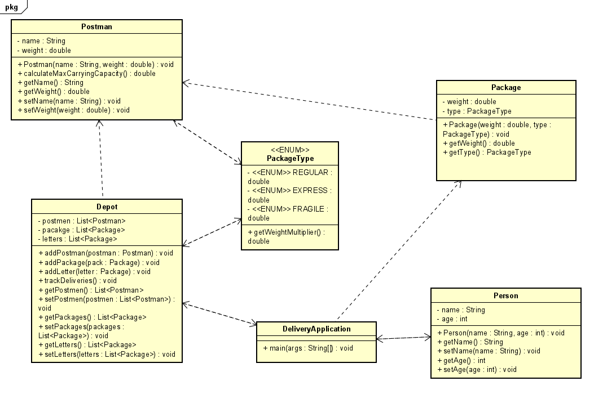

### Start Document for Post NL
Startdocument of Terry Ioannou. Student number 4976355.

#### Problem Description
From Java 2/ The Next Step! module book:

9. PostNL
   PostNL is THE company to get packages and letters to customers. PostNL wants
   healthy postmen so they want an application to measure the max amount of
   items the postman can carry. Every postman may carry a maximum weight of
   items. This weight is different for every postman. The maximum weight a
   postman can carry is calculated by multiplying the weight of the postman by 5.
   A package has a variable weight. A letter has a default of 2 grams.
   The Depot should know if they need to hire extra postmen so they are able to
   deliver all of the packages. The Depot tracks the amount of packages and
   letters delivered per postman per day and shows the name of the postman and
   the amount of packages and letters that he has delivered.

---

#### Class Diagram for PostNL

---

#### Input & Output

| Case                                 | Type                 | Conditions                   |
|--------------------------------------|----------------------|------------------------------|
| Name of postman                      | String               | not empty                    |
| Weight of postman                    | double               | number > 0                   |
| Weight of package                    | double               | number > 0                   |
| Weight of letter                     | double               | 2 grams (default)           |
| Maximum carrying capacity of postman | double               | Calculated (weight * 5)      |
| Number of packages delivered          | int                  | Non-negative integer         |
| Number of letters delivered           | int                  | Non-negative integer         |

#### Test Data

| Postman Name | Postman Weight (kg) |
|--------------|--------------------|
| John Doe     | 80.0               |
| Jane Smith   | 70.0               |

| Package Weight (kg) | Package Type |
|---------------------|--------------|
| 2.0                 | REGULAR      |
| 3.0                 | EXPRESS      |

| Letter Weight (kg) | Package Type |
|--------------------|--------------|
| 0.002 (2 grams)     | FRAGILE      |

---

#### Test Cases

### Start Document for Post NL
Startdocument of Terry Ioannou. Student number 4976355.

#### Problem Description
From Java 2/ The Next Step! module book:

9. PostNL
   PostNL is THE company to get packages and letters to customers. PostNL wants
   healthy postmen so they want an application to measure the max amount of
   items the postman can carry. Every postman may carry a maximum weight of
   items. This weight is different for every postman. The maximum weight a
   postman can carry is calculated by multiplying the weight of the postman by 5.
   A package has a variable weight. A letter has a default of 2 grams.
   The Depot should know if they need to hire extra postmen so they are able to
   deliver all of the packages. The Depot tracks the amount of packages and
   letters delivered per postman per day and shows the name of the postman and
   the amount of packages and letters that he has delivered.

---

#### Class Diagram for PostNL

---

#### Input & Output

| Case                                 | Type                 | Conditions                   |
|--------------------------------------|----------------------|------------------------------|
| Name of postman                      | String               | not empty                    |
| Weight of postman                    | double               | number > 0                   |
| Weight of package                    | double               | number > 0                   |
| Weight of letter                     | double               | 2 grams (default)           |
| Maximum carrying capacity of postman | double               | Calculated (weight * 5)      |
| Number of packages delivered          | int                  | Non-negative integer         |
| Number of letters delivered           | int                  | Non-negative integer         |

#### Test Data

| Postman Name | Postman Weight (kg) |
|--------------|--------------------|
| John Doe     | 80.0               |
| Jane Smith   | 70.0               |

| Package Weight (kg) |
|---------------------|
| 2.0                 |
| 3.0                 |

| Letter Weight (kg) |
|--------------------|
| 0.002 (2 grams)     |

---

#### Test Cases

**Test Case 1**  
*Description:* Calculate the maximum carrying capacity for Postman John Doe with specified weights and package type.

| Input | Action | Expected Output |
|-------|--------|----------------|
| John Doe, 80.0, REGULAR, 2.0 | Calculate max carrying capacity | Max carrying capacity: 400.0 kg |

**Test Case 2**  
*Description:* Calculate the maximum carrying capacity for Postman Jane Smith with specified weights and package type.

| Input | Action | Expected Output |
|-------|--------|----------------|
| Jane Smith, 70.0, EXPRESS, 3.0 | Calculate max carrying capacity | Max carrying capacity: 350.0 kg |

**Test Case 3**  
*Description:* Calculate the maximum carrying capacity for both Postmen with specified weights and package type.

| Input | Action | Expected Output |
|-------|--------|----------------|
| John Doe, 80.0, REGULAR, 2.0; Jane Smith, 70.0, EXPRESS, 3.0 | Calculate max carrying capacity | Max carrying capacity for John Doe: 400.0 kg, Max carrying capacity for Jane Smith: 350.0 kg |

**Test Case 4**  
*Description:* Track deliveries for Postmen John Doe and Jane Smith with specified weights, package type, and items.

| Input | Action | Expected Output |
|-------|--------|----------------|
| John Doe, 80.0, REGULAR, 2.0; Jane Smith, 70.0, EXPRESS, 3.0 | Track Deliveries for Postmen | Postman: John Doe   Packages Delivered: 2   Letters Delivered: 1 |

**Test Case 5**  
*Description:* This test case checks if the postman can deliver a package that is within their maximum carrying capacity.

| Input | Action | Expected Output |
|-------|--------|----------------|
| Postman carrying capacity: 50 kg | Package weight: 10 kg | Package delivered successfully |

**Test Case 6**  
*Description:* This test case checks if the postman can deliver a package that exceeds their maximum carrying capacity.

| Input | Action | Expected Output |
|-------|--------|----------------|
| Postman carrying capacity: 50 kg | Package weight: 60 kg | Package not delivered |

**Test Case 7**  
*Description:* This test case checks if the depot can accurately track the number of packages and letters delivered by each postman.

| Input | Action | Expected Output |
|-------|--------|----------------|
| Postman 1 packages delivered: 5, letters delivered: 2 | Postman 2 packages delivered: 3, letters delivered: 1 | Tracking information displayed correctly |

**Test Case 8**  
*Description:* This test case checks if the depot can accurately determine if additional postmen need to be hired based on the total number of packages and letters.

| Input | Action | Expected Output |
|-------|--------|----------------|
| Total packages: 50, Total letters: 30 | Total postmen: 5 | Additional postmen required: 3 |

**Test Case 9**  
*Description:* This test case checks if the depot can accurately handle an empty list of postmen.

| Input | Action | Expected Output |
|-------|--------|----------------|
| Empty list of postmen | Attempt to track deliveries | No deliveries tracked, no errors |

**Test Case 10**  
*Description:* This test case checks if the depot can accurately handle an empty list of packages.

| Input | Action | Expected Output |
|-------|--------|----------------|
| Empty list of packages | Attempt to track deliveries | No deliveries tracked, no errors |

**Test Case 11**  
*Description:* This test case checks if the depot can accurately handle an empty list of letters.

| Input | Action | Expected Output |
|-------|--------|----------------|
| Empty list of letters | Attempt to track deliveries | No deliveries tracked, no errors |

**Test Case 12**  
*Description:* This test case checks if the depot can accurately handle a situation where all packages and letters exceed the carrying capacity of all postmen.

| Input | Action | Expected Output |
|-------|--------|----------------|
| Postman carrying capacity: 20 kg | Package weight: 30 kg, Letter weight: 5 kg | No deliveries tracked, all items exceed carrying capacity |

**Test Case 13**  
*Description:* This test case checks if the depot can accurately handle a situation where all packages and letters are well within the carrying capacity of all postmen.

| Input | Action | Expected Output |
|-------|--------|----------------|
| Postman carrying capacity: 30 kg | Package weight: 15 kg, Letter weight: 2 kg | All items delivered successfully |

**Test Case 14**  
*Description:* This test case checks if the depot can accurately handle a situation where some packages and letters exceed the carrying capacity of some postmen.

| Input | Action | Expected Output |
|-------|--------|----------------|
| Postman 1 carrying capacity: 40 kg, Postman 2 carrying capacity: 30 kg, Package 1 weight: 35 kg, Package 1 type: REGULAR, Letter weight: 5 kg | Package 1 not delivered, Letter delivered successfully |

---
**Test Case 15**  
*Description:* This test case checks if the depot can accurately handle a situation where there are multiple postmen with the same carrying capacity.

| Input | Action | Expected Output |
|-------|--------|----------------|
| Postman 1 carrying capacity: 50 kg, Postman 2 carrying capacity: 50 kg | Package weight: 40 kg, Letter weight: 2 kg | Package and Letter delivered successfully |

**Test Case 16**  
*Description:* This test case checks if the depot can accurately handle a situation where there are multiple postmen with different carrying capacities.

| Input | Action | Expected Output |
|-------|--------|----------------|
| Postman 1 carrying capacity: 40 kg, Postman 2 carrying capacity: 50 kg | Package weight: 45 kg, Letter weight: 3 kg | Package not delivered, Letter delivered successfully |
---
